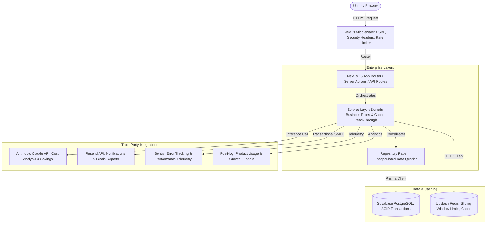
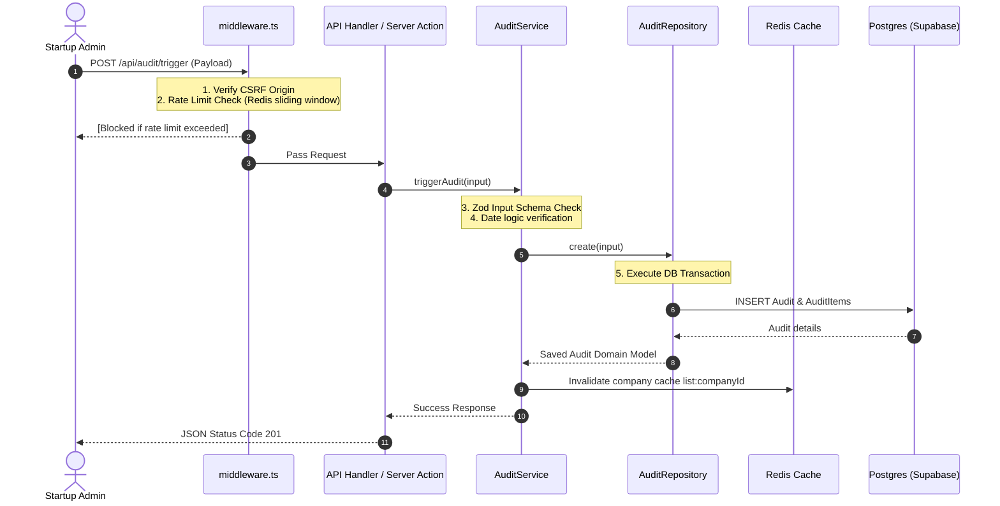

# Technical Architecture Document - AI Spend Intelligence Platform

This document describes the design principles, structural layouts, data flows, and systems integration of the **AI Spend Intelligence Platform**.

## 1. Architectural Style & Design Patterns

We adopted a hybrid of **Clean Architecture** and **Domain-Driven Design (DDD)** packaged in a **Feature-Based Layout**. 

### Key Decisions
1. **Feature-Based Organization**: Code is grouped by business capabilities (e.g. `audit`, `recommendations`, `reports`) rather than technical roles (`controllers`, `models`). This minimizes cognitive load and enhances code discoverability.
2. **Repository Pattern**: We abstract Prisma queries inside Repository classes. This separates storage query syntax from business domain operations, allowing us to mock database calls trivially during tests.
3. **Service Layer**: Business rules (e.g., verifying audit bounds, calculating potential savings) reside strictly in the service layer. Controllers and server actions act as simple entry points.
4. **Serverless Optimized Caching**: Using Upstash Redis via REST API avoids persistent TCP connections, fitting perfectly with Vercel's Serverless/Edge cold start optimization.

---

## 2. Platform Scalability Strategy

The platform is designed to scale horizontally across multi-region serverless endpoints while keeping database operations lean:

| User Tier | Scale Target | Architecture Strategy | Caching Layer |
| :--- | :--- | :--- | :--- |
| **Seed** (100 users) | 10 audits / day | Next.js Serverless + Single Node Supabase | In-memory Next.js caching |
| **Growth** (1,000 users) | 100 audits / day | Add Upstash Redis Cache to throttle database query workloads | API cache: 15m; Audit cache: 1hr |
| **Scale** (10,000 users) | 1,000 audits / day | Enable PostgreSQL Read Replicas; transition compute to Edge Runtime | DB read replica routing |
| **Enterprise** (100k+ users) | 10,000 audits / day | Decouple heavy analysis using Serverless Message Queues (SQS) | Pricing cache: 24hr |

---

## 3. Detailed Component Flow

### Audit Creation Flow

---

## 4. Performance & Telemetry Architecture

### Caching TTL & Invalidation
- **Pricing Catalog (24hr TTL)**: Tool models and prices change rarely. Cached aggressively.
- **Audit Detail (1hr TTL)**: Live audit summaries during report creation are read-through cached. If an audit is deleted or re-triggered, `invalidate("AUDIT", "detail:id")` is explicitly invoked.
- **API Responses (15m TTL)**: Decreases backend server overhead on high-frequency dashboards.

### Telemetry Pipeline
1. **Sentry**: Captures application exceptions, raw HTTP payload traces, and slow query executions.
2. **PostHog**: Tracks custom telemetry events (e.g. `audit_created`, `report_downloaded`) alongside growth attribution data.
