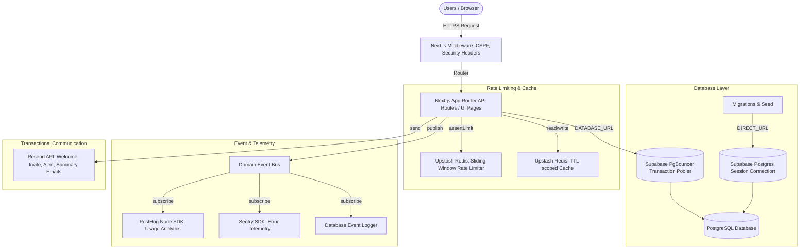

# Phase 5 Architecture Documentation — Production Infrastructure

This document provides a breakdown of the production-ready infrastructure activated for the **AI Spend Intelligence Platform**.

---

## 1. Database Connections & Scaling

* **PgBouncer Transaction Pooler (`DATABASE_URL`, port 6543)**:
  * Used by the serverless application routes.
  * Allows Vercel serverless functions to scale to thousands of concurrent instances without exhausting PostgreSQL connection limits.
  * Configured with `@prisma/adapter-pg` driver adapter.

* **Session Connection (`DIRECT_URL`, port 5432)**:
  * Used strictly for Prisma CLI commands (`prisma validate`, `prisma migrate dev`, `prisma db seed`).
  * Bypasses transaction-mode constraints to allow prepared statements (which Migrate requires).

---

## 2. Redis Caching & Sliding Window Rate Limiter

* **Fail-Safe Rate Limiting**:
  * Activated on `POST /api/audits` (limit: 10/hour per organization/IP) and `POST /api/leads` (limit: 5/minute per IP).
  * Uses Upstash Redis sorted sets (`zadd`, `zremrangebyscore`) via REST pipelining to avoid persistent TCP overhead.
  * Fail-safe execution: if Upstash goes down or is unconfigured, the app falls open (allows traffic) and logs a telemetry warning rather than crashing.
  * Appends standard rate limit tracking headers to API responses (`X-RateLimit-Limit`, `X-RateLimit-Remaining`, `X-RateLimit-Reset`).

* **Read-Through Caching**:
  * TTL-scoped caching layer for catalogs (24 hours), audit results (1 hour), and generated reports (2 hours) to optimize DB traffic.

---

## 3. Telemetry Pipeline & Observability

* **Event Bus Hook**:
  * Event handlers registered inside `event-bus.ts` forward events automatically:
    - `audit.completed` -> Tracked in PostHog (`audit_generated`) + logged in database (`Event` table).
    - `audit.failed` -> Telemetry error captured in Sentry + logged in database (`Event` table).
    - `report.generated` -> Tracked in PostHog (`report_generated`) + logged in database (`Event` table).
    - `email.failed` -> Exception logged in Sentry.
    - `share.created`, `share.viewed` -> Tracked in PostHog + logged in database (`Event` table).

---

## 4. Communication & Messaging Templates

* **Resend Transactional Emails**:
  * Configured retry architecture (3 attempts with exponential backoff).
  * Auto-logs transactions to the `EmailLog` database table for auditing.
  * Defined templates:
    1. `welcome_email`: Triggered automatically on dynamic user database auto-provisioning.
    2. `team_invitation`: Triggered on workspace invitations, containing a secure link to accept.
    3. `password_reset`: Instantiated template for self-service password recovery.
    4. `monthly_summary`: Configured template for monthly spend reporting.
