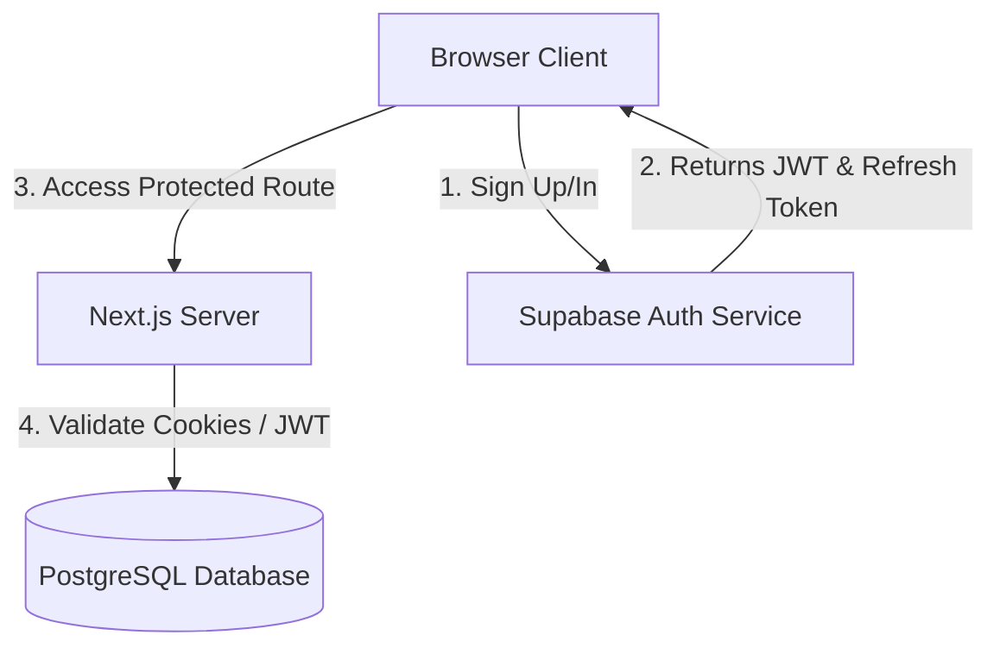

# Authentication Architecture

This document describes the security and session management architecture implemented in Phase 4.

## System Design

We use **Supabase Auth** as our identity provider (IdP). The system runs in two modes:

1. **Production Mode**: Connects directly to Supabase Auth with secure session cookies and database triggers syncing metadata.
2. **Mock Mode (Development Fallback)**: Operates entirely in-memory and in client storage (`localStorage`) if Supabase env vars are missing.

## Session Management

- **Storage**: Client credentials are automatically stored in secure HTTP-only cookies managed via `@supabase/ssr` middleware.
- **Refresh**: Next.js middleware interceptor automatically invokes `supabase.auth.getUser()` to trigger session and token refresh before expiry.
- **Mock Fallback**: In local development, the application stores mock user info in `aispend_mock_session` in `localStorage`, simulating auth flow without a Supabase connection.

## Client vs. Server Clients

- **Browser Client (`src/lib/supabase/client.ts`)**: Used inside Client Components (`'use client'`) for user registration, sign-in, and sign-out.
- **Server Client (`src/lib/supabase/server.ts`)**: Used in Server Components, Route Handlers, and Server Actions. Correctly reads and sets headers/cookies.
- **Admin Client**: The Server client can be elevated using `SUPABASE_SERVICE_ROLE_KEY` to perform administrative overrides (e.g. inviting users or modifying roles).

## Route Protection

Security is enforced at two levels:
1. **Edge Middleware**: Intercepts requests matching dashboard paths and redirects unauthenticated users to `/login`.
2. **API Guards**: API routes explicitly run authorization checks (`requireAuth()`) and return uniform 401 JSON payloads if invalid.
