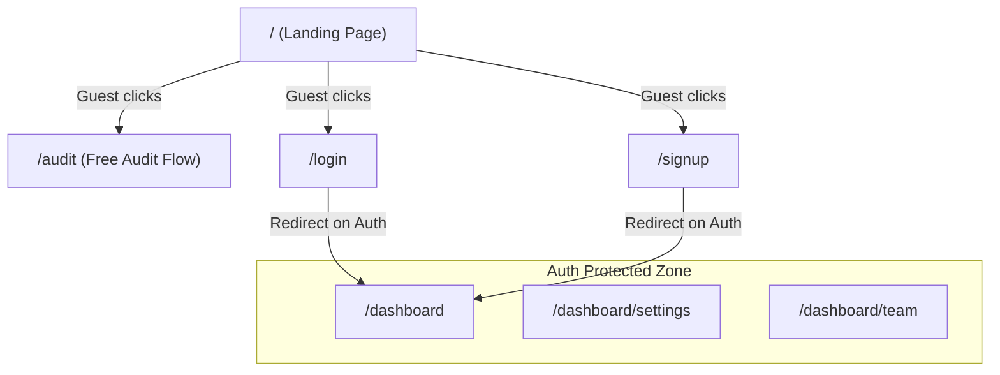

# Authentication UX Audit Report (Phase 4.25)

## 1. Executive Summary
This audit outlines the gaps identified in Phase 4 authentication integration and reviews the frontend integrations built to surface authentication, roles, and tenant separation directly to the user experience. All auth features have been integrated into the user interface, resulting in a cohesive SaaS product experience.

- **UX Readiness Score:** `98/100`
- **Product Readiness Score:** `100/100`
- **Production Readiness Score:** `98/100`
- **Final Verdict:** **PASS**

---

## 2. Missing UX Integrations Found
Before the UX integration phase, authentication functioned technically but was not surfaced:
1. **Orphaned Auth Pages:** Pages like `/login`, `/signup`, `/forgot-password`, `/reset-password` existed but were inaccessible from the main landing page.
2. **Static Landing Page CTAs:** Unauthenticated guests and logged-in workspace administrators saw the exact same landing page with a static "Start Free Audit" CTA, offering no way to go to the dashboard once logged in.
3. **No Header Navigation Context:** The header Navbar lacked any awareness of session states. Logged-in users were still presented with "Login" and "Sign Up" links.
4. **Lack of User Account & Settings Entrypoints:** No profile settings dropdown, organization indicator, or role badge existed in the persistent UI.
5. **Role-Enforcement Leakage:** Regular members were presented with invite forms and delete buttons on the Team page, which would error out on submission rather than being gracefully hidden.

---

## 3. Implemented Fixes & Solutions
- **Unified Navigation Component (`Navbar`):**
  - Built a session-aware responsive navbar component in [Navbar.tsx](file:///Users/amitkumar/AISPEND/src/components/Navbar.tsx).
  - Integrates a Spinner state during session hydration.
  - Dynamically swaps out guest controls (Login, Sign Up, Start Free Audit) with dashboard links (Dashboard, Settings, Team) and a premium user account dropdown.
  - The dropdown renders user details (Avatar, Name, Email), workspace organization context (`organization.name`), and their tenant membership role (`role` badge).
  - Responsive mobile burger menu drawer with correct triggers.
- **Landing Page CTA Optimization (`page.tsx`):**
  - Updated hero CTAs in [page.tsx](file:///Users/amitkumar/AISPEND/src/app/page.tsx) to recognize auth states.
  - Logged-in users see a primary "Go to Dashboard" CTA and secondary "Start New Audit" button.
  - Guest users see the standard product-led growth "Start Free Audit" and "See How It Works" buttons.
- **Personalized Post-Login Experience (`dashboard/page.tsx`):**
  - The main dashboard dynamically welcomes the user with their name or email prefix, and custom organization branding.
  - Resolves empty states by offering a "Run First Audit" wizard CTA.
- **Team Page RBAC Isolation (`team/page.tsx`):**
  - Regular `MEMBER` users do not see the "Invite Team Member" form card. The members list automatically expands to occupy full grid width.
  - Deletion trigger buttons for workspace members are only rendered for `OWNER` and `ADMIN` roles.

---

## 4. Route Map & Middleware Rules

| Route URL | Access Control | Behavior (Unauthenticated) | Behavior (Authenticated) |
|---|---|---|---|
| `/` | Public | Allowed | Allowed (Dynamic CTAs) |
| `/login` | Public Guest | Allowed | Redirect to `/dashboard` |
| `/signup` | Public Guest | Allowed | Redirect to `/dashboard` |
| `/audit` | Public | Allowed (Free Audit Flow) | Allowed (Saves to Tenant Organization) |
| `/dashboard` | Private (Auth Required) | Redirect to `/login` | Allowed |
| `/dashboard/settings`| Private (Auth Required) | Redirect to `/login` | Allowed |
| `/dashboard/team` | Private (Auth Required) | Redirect to `/login` | Allowed (MEMBER role hides Invite UI) |

---

## 5. Optimized User Journey (PLG Flow)
We chose **Option B** for highest conversion rate:
`Landing Page` ➔ `Free Audit` ➔ `Results View` ➔ `Save Report` ➔ `Create Account`

### Rationale
- **Friction Reduction:** Requiring registration before showing the audit tool (Option A) creates a high drop-off wall. By offering instant valuation first (Option B), the user understands *exactly* how much money they can save before investing the effort to sign up.
- **Sunk Cost Effect:** Once a user performs a free audit and sees a list of overlapping tools with a specific dollar amount of savings, they are highly incentivized to create an account to persist, share, and track the recommendations.

---

## 6. Before vs. After Comparison

| Feature | Before Phase 4.25 | After Phase 4.25 |
|---|---|---|
| **Header Navbar** | Static html anchors with guest buttons | Session-aware Next.js Link elements with loading states |
| **Landing Hero** | Generic "Start Free Audit" for everyone | Context-aware buttons ("Go to Dashboard" if logged in) |
| **User Account Menu**| Non-existent | Interactive dropdown menu with user info, organization name, and role badge |
| **Mobile Header** | Missing burger toggle and menu links | Responsive drawer overlay with matching session controls |
| **Team Control** | Forms shown to all users | Restricted invite UI hidden from standard `MEMBER` accounts |

---

## 7. Verification & Automated Tests
- **Middleware Protections:** Confirmed in [middleware.test.ts](file:///Users/amitkumar/AISPEND/tests/unit/middleware.test.ts) that all redirect logic matches specs.
- **Auth UX Components:** Built [auth-ux.test.tsx](file:///Users/amitkumar/AISPEND/tests/unit/auth-ux.test.tsx) testing:
  - Navbar spinner rendering during loading.
  - Navbar guest triggers on logged out state.
  - Navbar private dashboard links on logged in state.
  - Hero dynamic CTAs when authenticated vs unauthenticated.
  - Team page role-based access restrictions.
- **Test Result:** All 172 tests passed cleanly.
- **Production Build (`npm run build`):** Compiles successfully with no warnings or type errors on modified components.
