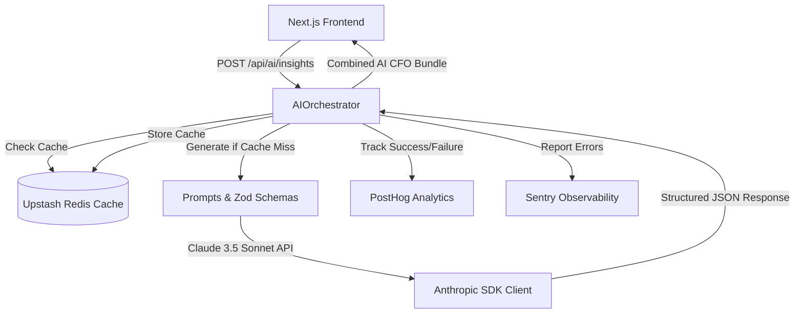

# Phase 6A: AI Executive Intelligence Layer Architecture

This document describes the architectural layout, components, prompt engineering rules, caching mechanisms, and observability wiring implemented for the AI Executive Intelligence Layer (AI CFO) in AISPEND.

## 1. Architectural Overview

The AI Executive Intelligence Layer transforms AISPEND from a raw audit scanner into a qualitative, strategic "AI CFO". It uses Anthropic's Claude 3.5 Sonnet to generate natural language summaries, explanations, and opportunity analyses.

---

## 2. Core Constraints: No Calculation Rule

A fundamental constraint of the AI Executive Intelligence Layer is that the **LLM must NEVER perform any mathematical calculations** (such as addition, subtraction, division, or percentage computation). 

* **Why**: Large Language Models are prone to arithmetic errors and hallucinating metrics, which reduces platform credibility.
* **Solution**: All financial, score, and percentile calculations are computed deterministically in the core TypeScript engine. These raw results are fed into the prompt templates as variables. The LLM is instructed strictly to **explain, summarize, and prioritize** these numbers without altering or computing new ones.

---

## 3. Anthropic Provider Client

The `AnthropicProvider` wrapper coordinates communication with the Anthropic API:
* **Model**: `claude-3-5-sonnet-20241022`.
* **Transient Error Handling**: Includes a 3x exponential backoff retry system.
* **Timeout Controls**: Enforces a strict 10-second client-side timeout using an abort controller to prevent API hangs.
* **Structured Output Validation**: Utilizes strict Zod schemas to parse and validate Claude's JSON outputs, guaranteeing type safety.
* **Development/Test Fallback Mode**: When the `ANTHROPIC_API_KEY` is not set or during testing, it falls back to a deterministic, schema-compliant mock generator to avoid hitting API rate limits or consuming tokens.

---

## 4. CFO Explainer Services

The layer is divided into five modular explainer services, each matching a specific Zod validation schema:

1. **`ExecutiveSummaryService`**: Summarizes the company's spend, savings, health grade, and overall risk posture.
2. **`RecommendationExplainerService`**: Explains a specific recommendation drawer (why the issue exists, expected outcome, operational risk, implementation complexity, confidence, and business impact).
3. **`HealthScoreExplainerService`**: Explains the health grade, subscore breakdowns, system strengths, weaknesses, and improvement items.
4. **`BenchmarkNarrativeService`**: Contextualizes benchmark percentiles, industry comparison averages, and optimization potential against sector peers.
5. **`OpportunityInsightService`**: Sifts through all rule recommendations to pick and rank the top 3 highest-priority saving opportunities.

---

## 5. Concurrent Orchestration and Caching

To optimize page loading times and reduce user latency, the `AIOrchestrator` aggregates requests:
* **Concurrence**: Uses `Promise.all` to query all explainer services concurrently.
* **Caching**: Stores the combined insights bundle in Upstash Redis (`ai_insights:${auditId}`) with a 24-hour Time-To-Live (TTL).
* **Bypass Cache**: Allows explicit cache bypass (`bypassCache: true`) to force AI recalculations when inputs change.

---

## 6. Observability and Monitoring

Every AI generation is fully instrumented for telemetry:
* **PostHog Client Tracking**: Capture events for `ai_insights_cache_hit`, `ai_insights_cache_miss`, `ai_insights_generation_success`, and `ai_insights_generation_failed`, logging generation latencies and token/request metadata.
* **Sentry Sync**: Catch and report SDK timeout, rate-limiting, and schema validation failures directly to Sentry with error stack traces.
